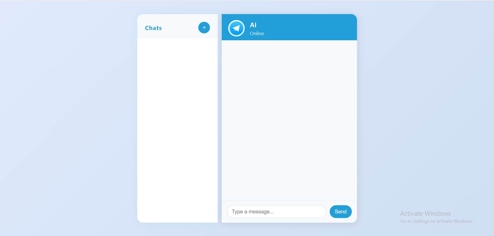
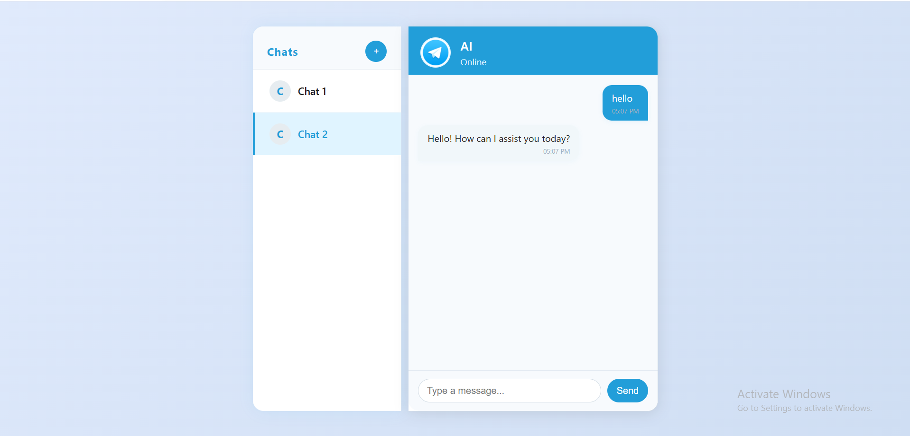

# OpenAI Chat Assistant with Multi-Chat Memory | Frontend + GPT-4o 💬🤖

A sleek and responsive AI-powered chat interface built with **HTML**, **CSS**, and **Vanilla JavaScript**. This project allows users to interact with OpenAI's GPT model via a clean, modern, and mobile-friendly UI, supporting multiple chats and formatting-aware responses.



## ✨ Features

- 📱 **Responsive Design** — Works beautifully on desktop and mobile
- 🤖 **OpenAI Integration** — Uses the `gpt-4o-mini` model via OpenAI API
- 💬 **Multi-Chat Support** — Save, switch, and resume conversations
- 🎨 **Typing Indicator** — Displays animated bot typing feedback
- 🧠 **Formatting Awareness** — Bot respects user-specified line counts (e.g., "Explain OOP in 2 lines")
- 🕒 **Timestamps** — Every message is timestamped for context

## 📁 Project Structure

```bash
├── index.html        # Main HTML structure
├── style.css         # All styles including responsive design
├── script.js         # Full chat logic, OpenAI API calls, and history handling
├── /screenshots
│   ├── 1.png         # Main UI screenshot
│   └── 2.png
│   └── record.gif        # Additional example
```

## 🚀 Getting Started

1. Clone the repository or download the project.
2. Replace the API key in `script.js` with your own OpenAI key.
3. Open `index.html` in any browser to get started!

```bash
# Optional if using Git
git clone https://github.com/ahmedgaafer1/gpt-prompt-box.git
cd ai-chat-interface
```

## 🔐 API Key Configuration ✅

⚠️ **Important:** For security reasons, the `API key` used to access OpenAI's services has **not been included** in this project.

To run the project successfully:

1. Create an API key from your [OpenAI account](https://platform.openai.com/account/api-keys).
2. Open the `script.js` file.
3. Replace the placeholder string `const apiKey = "your-api-key-here";` with your actual API key.

## 🧠 Sample Instruction

Try entering prompts like:

```text
describe oop

```

The AI will respond with exactly the number of lines requested.

## 🎥 Live Demo

Here’s a quick preview of the chat assistant in action:


## 📸 Screenshots

 

## 🛠 Technologies Used

- HTML5
- CSS3 (Responsive + Animations)
- JavaScript (Fetch API + DOM)
- OpenAI API (Chat Completions)

## 📌 Notes

- The API key should **never** be exposed in production. Consider using a backend proxy for real deployments.
- This project is for learning/demo purposes.

## 👨‍💻 Author

Ahmed Gaafer  
[LinkedIn](https://www.linkedin.com/in/ahmedgaafer/) | [GitHub](https://github.com/ahmedgaafer1)

---

> Crafted with ❤️ by Ahmed Gaafer — blending frontend finesse with OpenAI power.
